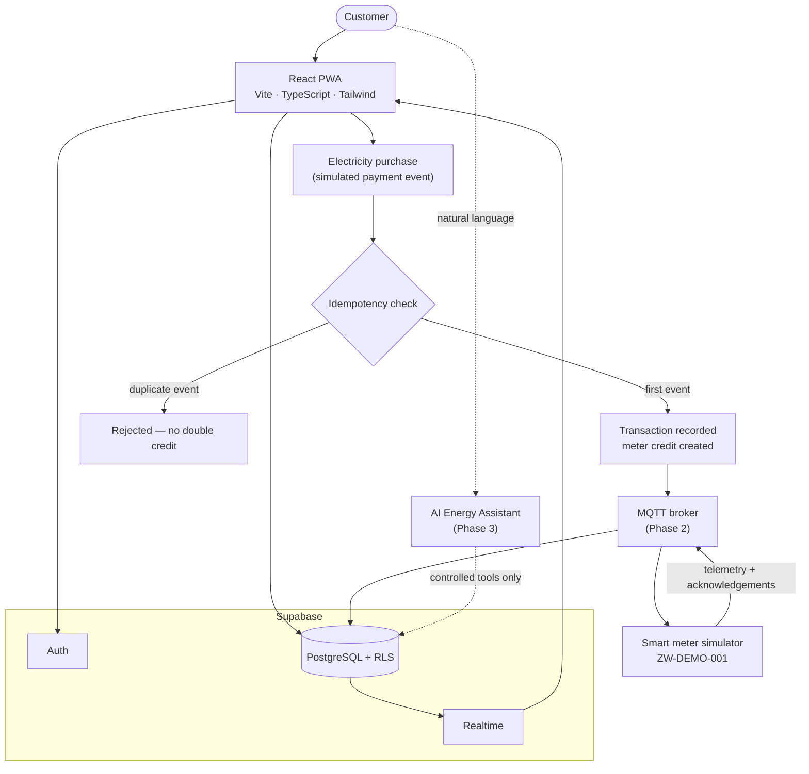
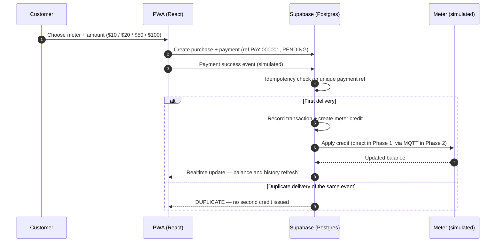

# ZimSmartMeter

**An independent proof-of-concept exploring automated prepaid electricity crediting and smart-meter integration** — built as a modern PWA with React, TypeScript, Supabase, MQTT and an AI energy assistant.


> **⚠️ Important disclaimer**
>
> ZimSmartMeter is an **independent technical demonstration**. It is **not affiliated with ZESA** or any utility company, does **not** connect to any production utility infrastructure, and uses **no proprietary APIs, credentials, systems, branding, or confidential information**. All meters, payments, readings and balances in this project are **clearly labelled synthetic demo data** (e.g. `DEMO-METER-001`). No real money moves and no real electricity is dispensed.

**Status:** ⚡ All three phases live — payments, IoT telemetry, AI assistant
**Live demo:** [zimsmartmeter.netlify.app](https://zimsmartmeter.netlify.app)

---

## The problem

Prepaid electricity is a daily reality for millions of households in Zimbabwe. The typical flow is manual end to end: buy a token at a vending point or via mobile money, receive a 20-digit code, and key it into the meter by hand. Along the way customers deal with vending downtime, mistyped tokens, duplicate-payment disputes, and near-zero visibility — you only know your remaining units by walking to the meter, and you have no picture of how fast you are consuming them.

## The concept

What if crediting were event-driven end to end? A payment event is verified, checked for duplicates, and automatically dispatched as a credit to a connected smart meter — with the balance, consumption history, and meter status visible in real time on the customer's phone, and an AI assistant that can answer questions like *"how long will my current balance last?"* from actual usage data.

ZimSmartMeter simulates that complete loop using production-grade engineering patterns: idempotent payment processing, database-enforced integrity, row-level security, MQTT device telemetry, realtime dashboards, and a tool-restricted AI layer.

---

## What it demonstrates (roadmap)

### Phase 1 — Professional MVP *(in progress)*

- [x] Landing page and Supabase authentication (sign up, login, protected routes, session persistence)
- [x] Register and view demo meters — balance, status, last reading, last communication
- [x] Electricity purchase — any amount $5–$1,000 — via **instant (simulated)**, **cash-at-agent**, **ManishaPay**, and **direct PayNow** methods, priced by a configurable tariff
- [x] Idempotent payment processing → automatic meter credit, duplicate-safe at the database level
- [x] Transaction history and daily consumption chart
- [x] Mobile-first responsive UI, installable as a PWA
- [x] PostgreSQL schema with Row Level Security and audit logging
- [x] Production deployment to Netlify with a clean, incremental Git history

### Phase 2 — Smart-meter / IoT simulation

- [x] Device-like smart meter simulator: connects, authenticates, publishes readings, handles reconnects
- [x] MQTT telemetry — voltage, current, power, energy consumed
- [ ] Credit commands and acknowledgements delivered over MQTT *(stretch)*
- [x] Realtime dashboard updates via Supabase Realtime (balance, status, new readings, new transactions)

### Phase 3 — AI Energy Assistant

- [x] LLM assistant with **controlled tool calling** — no unrestricted database access
- [x] Balance queries, consumption comparisons, and depletion estimates in natural language
- [x] Guardrails: never invents readings or transactions, labels estimates as estimates, respects per-user authorization

---

## Architecture



Guiding principles:

- **Event-driven crediting.** A verified payment event — not a UI click — is what produces a meter credit.
- **The database does real work.** Constraints, foreign keys and unique indexes enforce the money-critical invariants; the frontend is never the last line of defence.
- **Least privilege everywhere.** RLS on every user-facing table, no service-role keys in the browser, admin access designed explicitly rather than bypassing security.
- **Realtime where it earns its place.** Live subscriptions for balance/status/transactions; plain queries where realtime adds nothing.
- **AI behind an application boundary.** The assistant calls a small set of typed tools; it never executes arbitrary SQL from user input.

---

## Technology stack

| Layer | Choice | Notes |
|---|---|---|
| Frontend | React + TypeScript + Vite | Strict types, fast iteration, modern build tooling |
| Styling | Tailwind CSS | Consistent, mobile-first design system |
| PWA | vite-plugin-pwa | Manifest, service worker, installability, offline caching |
| Backend platform | Supabase | Auth, PostgreSQL, Realtime, application services |
| Database | PostgreSQL | UUIDs, constraints, indexes, versioned migrations |
| Validation | Zod | Shared, centralized input validation |
| State | React state / context | No Redux unless a genuine need appears |
| IoT transport | MQTT *(Phase 2)* | Free development broker; no credentials in frontend code |
| AI *(Phase 3)* | Provider-agnostic abstraction | Provider-specific code kept isolated and swappable |
| Testing | Vitest + React Testing Library | Unit, component and transaction-logic tests |
| Charts | Lightweight React charting library | Chosen during Phase 1 dashboard work |
| Hosting | Netlify (frontend) + Supabase (backend) | SPA redirects, environment-based configuration |

---

## Database design

Core entities:

`users` · `meters` · `meter_readings` · `payments` · `electricity_purchases` · `meter_credits` · `transactions` · `tariffs` · `audit_logs` · `notifications`

Design rules applied throughout:

- UUID primary keys; explicit foreign keys with supporting indexes
- Database constraints protect financial integrity — e.g. a **unique payment reference** makes double-crediting structurally impossible
- Tariffs are modelled as configuration, never hardcoded in multiple places
- Timestamps and audit logs on everything money-related
- Schema changes ship as **versioned Supabase migrations**, not dashboard edits
- **Row Level Security** on every user-facing table: users can only reach their own profile, meters, readings, purchases, credits and transactions

---

## Payment & crediting flow



**Why idempotency is front and centre:** real payment webhooks get delivered twice, retried, and replayed. If `PAY-000001` succeeds and the same event arrives again, the correct outcome is *exactly one* credit. This project enforces that in the database — unique constraints and transactional writes — rather than trusting frontend checks.

---

## MQTT design *(Phase 2)*

Topic convention:

```
meters/{meterId}/telemetry
meters/{meterId}/status
meters/{meterId}/credit
meters/{meterId}/commands
```

- Sample telemetry: `{ meterId, voltage, current, power, energyConsumed, timestamp }`
- The simulator behaves like a device: connects, authenticates where supported, publishes readings, receives credit commands, acknowledges, and survives disconnects
- No sensitive information in topic names; no broker credentials in frontend code
- A public/free broker is used **for development only** — see [Known limitations](#known-limitations)

---

## AI Energy Assistant *(Phase 3)*

The assistant accesses the system exclusively through a controlled tool layer:

```
get_meter_balance() · get_recent_transactions() · get_daily_consumption()
get_consumption_comparison() · estimate_remaining_days() · get_meter_status()
get_recent_meter_events()
```

Reliability rules:

- Never invents meter readings, transactions, or payment outcomes
- Clearly distinguishes **estimates** from actual readings
- Cannot see another user's data — authorization is enforced below the AI layer, not by the prompt
- Never executes arbitrary SQL from user input
- The provider sits behind an abstraction so models/services can be swapped without touching application code

---

## Security considerations

- Supabase **Row Level Security** with explicitly designed admin access
- **No service-role keys in browser code** — the anon key is safe in the client *only because* RLS does the enforcement
- Secrets via environment variables; nothing sensitive committed to the repository
- Input validation with Zod **and** database constraints — defence in depth
- Idempotent, replay-safe processing of payment events; audit logs with transaction IDs
- HTTPS everywhere; secure error handling that doesn't leak internals
- Honest scoping: the README and UI state plainly what is demo-grade and what a real production deployment would additionally require

---

## PWA & offline behaviour

The app is installable on mobile and desktop. The dashboard and read-only views are cached for resilience when the connection drops — but **payment processing deliberately requires connectivity**. A financial transaction should never pretend to succeed offline; this project treats that as a feature, not a gap.

---

## Getting started

> The Phase 1 scaffold lands with the first commits — until then, the steps below describe the intended local workflow.

**Prerequisites:** Node.js 20+, npm, a free [Supabase](https://supabase.com) project, and optionally the Supabase CLI.

```bash
git clone https://github.com/nobytechy/ZimSmartMeter.git
cd ZimSmartMeter
npm install
cp .env.example .env    # then add your Supabase values
npm run dev
```

### Environment variables

| Variable | Purpose |
|---|---|
| `VITE_SUPABASE_URL` | Your Supabase project URL |
| `VITE_SUPABASE_ANON_KEY` | Public anon key (safe in the browser under RLS) |

The Supabase **service-role key is never used in this repository's frontend code** and must never be added to it.

### Database setup

Migrations live in `supabase/migrations/` and are applied with the Supabase CLI (`supabase db push`) or via the SQL editor. Seed data creates clearly labelled demo meters (`DEMO-METER-001`, `DEMO-METER-002`, …).

### Testing

```bash
npm run test
```

Minimum coverage targets: tariff calculation, purchase maths, duplicate-payment handling, meter crediting, and authentication-dependent rendering.

---

## Deployment

- **Netlify** builds the PWA (`npm run build`, publish `dist/`) with an SPA redirect (`/* → /index.html 200`) and environment variables set in the Netlify UI
- **Supabase** hosts the database, auth and realtime layers
- PWA assets and service-worker caching are configured for safe cache invalidation between releases

---

## Project structure *(planned)*

```
src/
├── components/     # Reusable UI building blocks
├── features/       # Feature modules (auth, meters, purchases, dashboard)
├── layouts/        # App shells and page layouts
├── pages/          # Route-level pages
├── hooks/          # Shared React hooks
├── lib/            # Client setup (Supabase, MQTT, AI provider)
├── services/       # Application services / data access
├── types/          # Shared TypeScript types
├── utils/          # Pure helpers (tariff maths, formatting)
├── integrations/   # External integrations, kept isolated
└── styles/         # Global styles / Tailwind setup
supabase/
└── migrations/     # Versioned database migrations
```

---

## Known limitations

- Payments are **simulated** — no real payment service provider is integrated and no money moves
- Meters are **simulated** — the simulator is not real metering hardware and does not generate real STS tokens
- The development MQTT broker is a public/free service — not production-grade transport security
- Demo tariff model only — real utility tariff structures are more complex
- PayNow's edge filters requests from Supabase's egress IPs, so the live PayNow lane routes through ManishaPay (`provider: "paynow"`); the byte-accurate direct-protocol implementation ships as a reference in `supabase/functions/paynow-direct`
- This is an independent proof-of-concept: a real deployment would require a formal utility partnership, certified hardware, and regulatory compliance

---

## Future improvements

Consumption anomaly detection · weekly usage summaries · estimated depletion notifications · usage trend explanations · energy-saving suggestions · natural-language transaction search · multi-meter households · admin analytics console

---

## Live demo

**[zimsmartmeter.netlify.app](https://zimsmartmeter.netlify.app)** — sign in with a demo number
(`+263 77 000 0001`, code `123456`), claim a meter, buy power, then open
the Simulator and watch the balance drain live.

---

## About this project

Built by **Noby** ([@nobytechy](https://github.com/nobytechy)) as a portfolio-grade demonstration and a hands-on deep-dive into modern full-stack architecture, event-driven payment integrity, IoT/MQTT patterns, and AI tool-calling.

The full build specification and phased workflow live in [CLAUDE.md](./CLAUDE.md) — the project is built incrementally with AI-assisted development, one reviewed phase at a time.
